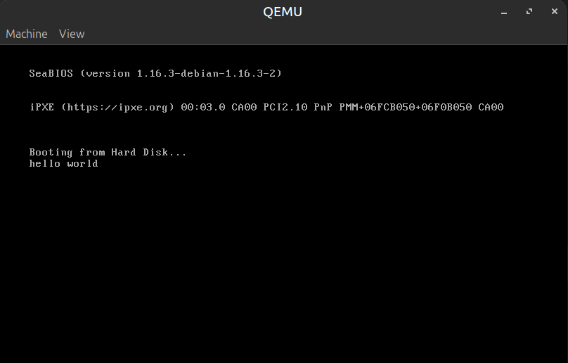
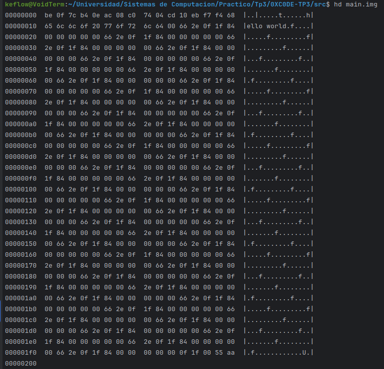
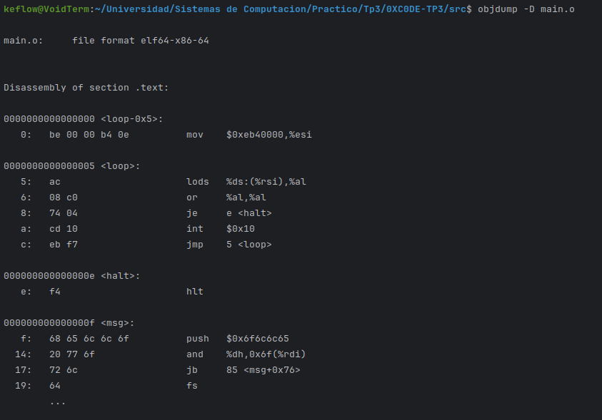
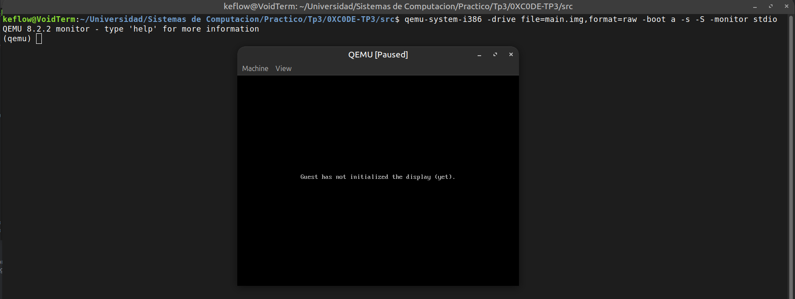
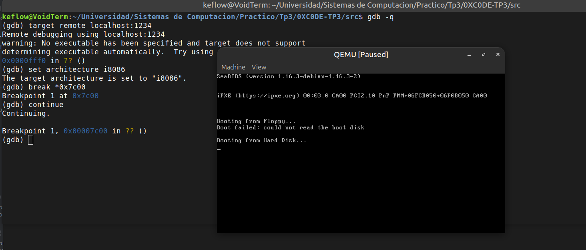
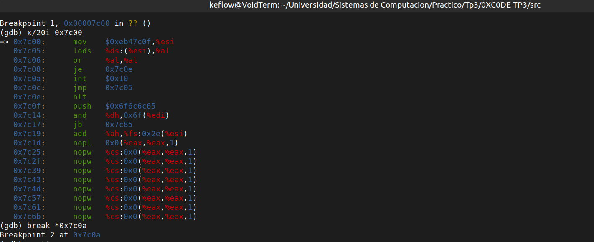
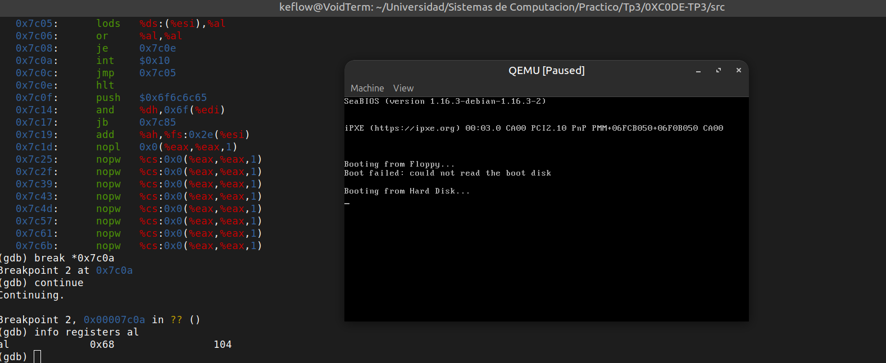
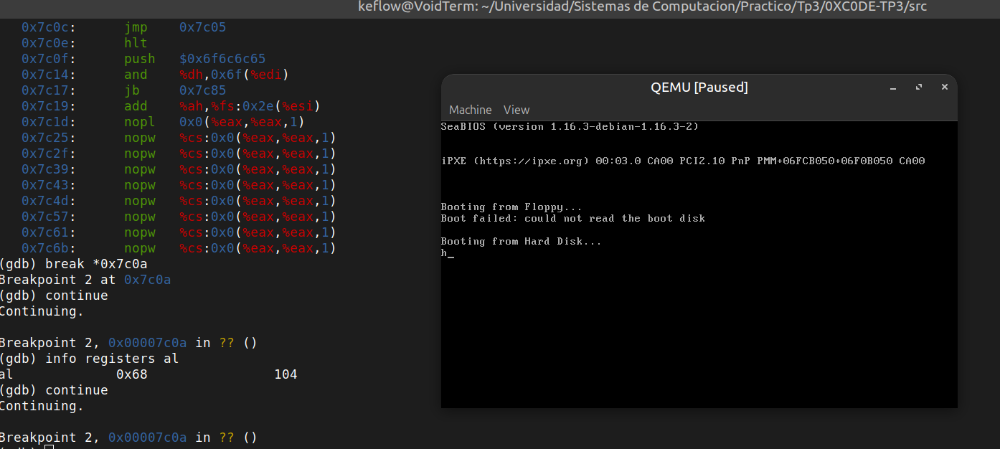
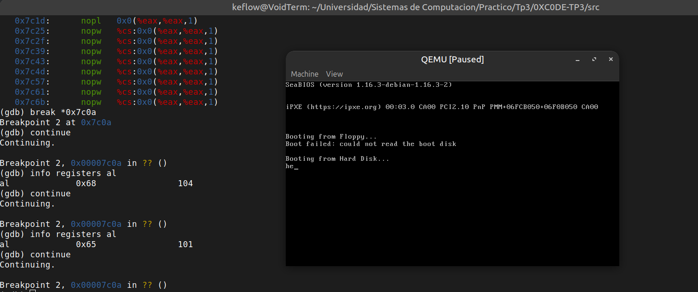
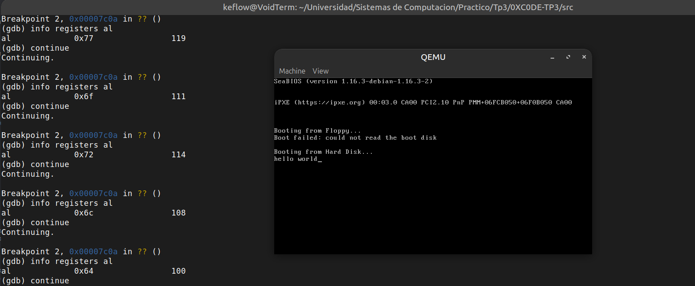

# **Tp3 Modo Protegido**

## **UEFI**

### **¿Que es UEFI y como se usa?**

La interfaz de firmware extensible unificada o UEFI (del inglés unified extensible firmware interface) es una especificación que define una interfaz entre el sistema operativo y el firmware. UEFI reemplaza la antigua interfaz del sistema básico de entrada y salida (BIOS) estándar presentado en los PC IBM como ROM BIOS de PC IBM.
  
Se usa principalmente interactuando con su menú de configuración durante el arranque del sistema (generalmente presionando teclas como F2, F10, F12, SUPR o ESC, dependiendo del fabricante). Estando ahí, se pueden modificar opciones como el orden de arranque, configuraciones de seguridad, habilitar/deshabilitar componentes de hardware, actualizar el propio firmware UEFI, y configurar parámetros de rendimiento o perfiles de memoria RAM.

### **Casos de BUGS de UEFI**

Investigadores de ESET han descubierto una vulnerabilidad que permite eludir el UEFI Secure Boot y que afecta a la mayoría de los sistemas basados en UEFI. Esta vulnerabilidad, asignada CVE-2024-7344, se encontró en una aplicación UEFI firmada por el certificado UEFI de terceros de Microsoft Microsoft Corporation UEFI CA 2011. La explotación de esta vulnerabilidad conduce a la ejecución de código no fiable durante el arranque del sistema, lo que permite a los atacantes potenciales desplegar fácilmente bootkits UEFI maliciosos (como Bootkitty o BlackLotus) incluso en sistemas con UEFI Secure Boot habilitado, independientemente del sistema operativo instalado.

La aplicación UEFI afectada forma parte de varias suites de software de recuperación de sistemas en tiempo real desarrolladas por Howyar Technologies Inc., Greenware Technologies, Radix Technologies Ltd., SANFONG Inc., Wasay Software Technology Inc., Computer Education System Inc. y Signal Computer GmbH. 

La vulnerabilidad está causada por el uso de un PE loader personalizado en lugar de utilizar las funciones estándar y seguras de UEFI LoadImage y StartImage. Como resultado, la aplicación permite la carga de cualquier binario UEFI - incluso uno sin firmar - desde un archivo especialmente diseñado llamado cloak.dat, durante el arranque del sistema, independientemente del estado de arranque seguro UEFI.

### **CSME y Intel MEBx**

**Converged Security and Management Engine (CSME)** es un subsistema crítico integrado en los chipsets de Intel que proporciona capacidades de seguridad y gestión. Este componente es el núcleo que impulsa la tecnología Intel® Active Management Technology (Intel® AMT), una funcionalidad que permite la gestión remota de sistemas incluso cuando están apagados o el sistema operativo no está operativo. El CSME opera de manera independiente del procesador principal, utilizando su propio firmware y memoria, lo que lo convierte en una parte esencial de la arquitectura de la plataforma Intel vPro®. Entre sus funciones clave se encuentra garantizar el acceso remoto seguro y las capacidades de gestión, como la comunicación fuera de banda (out-of-band), que son fundamentales para que los administradores de TI puedan mantener y solucionar problemas en los sistemas de forma remota.

**Intel Management Engine BIOS Extension (MEBx)** es una extensión de la BIOS que permite a los usuarios configurar el Management Engine, incluyendo los ajustes relacionados con Intel® AMT. Se accede típicamente durante el proceso de arranque presionando una combinación de teclas específica, como Ctrl+P, lo que abre una interfaz donde se pueden establecer configuraciones de red, parámetros de seguridad (como la contraseña del CSME) y habilitar funciones de AMT. El MEBx es un componente estándar en sistemas con capacidades de Intel AMT y está implícito en las referencias a la configuración manual y el acceso al CSME durante el arranque.

## **Coreboot**

### **¿Que es Coreboot?**

**Coreboot**, anteriormente conocido como **LinuxBIOS**, es un proyecto iniciado en 1999 en el Advanced Computing Laboratory en Los Alamos National Laboratory, con el objetivo de crear un firmware que arranque rápidamente y maneje errores de manera inteligente. Su diseño filosófico se centra en realizar solo las tareas mínimas necesarias para inicializar el hardware, como configurar el controlador de memoria, la CPU y los periféricos, y luego transferir el control a un "payload", que puede ser un cargador de arranque como SeaBIOS (para servicios PCBIOS), edk2 (para UEFI), GRUB2 (usado por muchas distribuciones Linux) o depthcharge (común en Chromebooks).

Esta separación de responsabilidades permite maximizar la reutilización de las rutinas de inicialización de hardware, adaptándose a una amplia gama de casos de uso, desde interfaces estándar hasta flujos de arranque completamente personalizados. Coreboot está licenciado bajo la **GNU** General Public License versión 2 (GPLv2), lo que garantiza su naturaleza de software libre y fomenta la colaboración comunitaria. Es compatible con múltiples arquitecturas de CPU, incluyendo IA-32, x86-64, ARM, ARM64, MIPS y RISC-V, y soporta plataformas específicas como AMD Geode, Intel Atom y Ryzen Embedded, entre otras.

### **¿Que productos lo incorporan?**

Coreboot se utiliza en una variedad de dispositivos, especialmente en notebooks y PCs diseñadas para usuarios que priorizan la libertad de software y la seguridad. A continuación, se detalla una lista de productos y fabricantes que lo incorporan, basada en información de sitios oficiales y foros especializados:

|  **Fabricante** |**Productos**   | **Informacion** |
|---|---|---|
|  Google |  Chromebooks (todos menos los tres primeros modelos) |  Mayor despliegue de coreboot, usado en dispositivos Chrome OS. | 
| Purism  | Notebooks Librem (como Librem 13 v2, Librem 15 v3)  |  Enfocados en privacidad, con coreboot preinstalado y soporte para PureBoot. |  
|  Minifree Ltd | Notebooks y desktops con Libreboot  | Ofrecen Libreboot preinstalado, junto con Debian Linux u otros BSD  | 
|  Lenovo Thinkpad | Modelos como T480, X220, X230  | Compatible con coreboot, especialmente en distribuciones como Libreboot y Skulls.  | 
|  StarLabs Systems |  Notebooks |  Ofrecen por defecto la alternativa de coreboot | 

### **Ventajas de la utilización de coreboot**

El uso de coreboot ofrece múltiples beneficios, especialmente para usuarios técnicos, entusiastas de software libre y organizaciones que buscan mayor control y seguridad en sus sistemas. A continuación, se enumeran las ventajas:
- **Rendimiento y eficiencia:** Coreboot está diseñado para arrancar rápidamente, realizando solo las tareas esenciales de inicialización. Por ejemplo, la versión x86 ejecuta solo diez instrucciones antes de pasar al modo de 32 bits, similar a los sistemas UEFI modernos, lo que reduce significativamente los tiempos de arranque.

- **Seguridad y transparencia:** Escrito principalmente en C, con menos del 1% en ensamblador, coreboot es más fácil de auditar que los BIOS tradicionales basados en ensamblador, lo que mejora la seguridad al reducir la superficie de ataque. Además, al ser de código abierto permite a los usuarios y desarrolladores revisar, modificar y mejorar el firmware, aumentando la transparencia. Esto es especialmente valioso para detectar vulnerabilidades y garantizar la integridad del sistema.

- **Flexibilidad y personalización:** Permite el uso de diferentes "payloads", como SeaBIOS para arranque legacy, iPXE para arranque por red, o edk2 para entornos UEFI, lo que ofrece flexibilidad para adaptarse a diversas necesidades. Los usuarios pueden personalizar aspectos como pantallas de arranque (en formato JPG), consolas de depuración accesibles vía puertos seriales, USB, SPI o incluso el altavoz de la PC, y recuperar registros de arranque una vez que el sistema operativo esté en funcionamiento.

- **Reutilización y mantenimiento:** Maximiza la reutilización de rutinas de inicialización de hardware a través de la separación de preocupaciones entre coreboot y el payload, lo que facilita su uso en diferentes escenarios, desde dispositivos estándar hasta aplicaciones especializadas. Evita la fragmentación manteniendo todo en un solo árbol de código fuente

## **Linker**

### **¿Que es un Linker?¿Que hace?**
Un linker, también conocido como editor de enlaces, es un componente esencial en el proceso de compilación de programas.
Toma uno o más archivos objeto, que son el resultado de la compilación de código fuente (por ejemplo C o ensamblador) 
por un compilador y los combina en un solo archivo ejecutable, biblioteca o archivo objeto adicional. 

Su función principal incluye lo siguiente:
- **Resolución de referencias externas:** conecta llamadas a funciones o referencias a variables que están definidas en otros archivos objeto. Por ejemplo, si un archivo objeto A necesita usar una función definida en B, el linker resuelve esta dependencia.
- **Relocalización:** ajusta las direcciones de los archivos objeto para reflejar sus posiciones finales en memoria, asegurando que las instrucciones y datos se alojen correctamente.
- **Generación de archivos ejecutables:** crea un archivo ejecutable que puede ser cargado y ejecutado por el sistema operativo, o en este caso, por la BIOS para un sector de arranque.

### Scripts
Para continuar con los desafíos, se detallan los scripts que se van a utilizar y a los cuales se va a hacer referencia.

Primero tenemos el **linker** que lo denominamos **link.ld** el cual extraemos de la carpeta examples/HelloWorld
```plaintext
SECTIONS
{
    /* The BIOS loads the code from the disk to this location.
     * We must tell that to the linker so that it can properly
     * calculate the addresses of symbols we might jump to.
     */
    . = 0x7c00;
    .text :
    {
        __start = .;
        *(.text)
        /* Place the magic boot bytes at the end of the first 512 sector. */
        . = 0x1FE;
        SHORT(0xAA55)
    }
}
```

Además, incorporamos el código **main.S** que está escrito en ensamblador y la extensión **".S"** indica que el archivo debe pasar por el preprocesador de C/C++ antes de ensamblarse, lo cual implica que pueden contener directivas como: #include, #define, etc. 

```asm
.code16
    mov $msg, %si
    mov $0x0e, %ah
loop:
    lodsb
    or %al, %al
    jz halt
    int $0x10
    jmp loop
halt:
    hlt
msg:
    .asciz "hello world"

```

### **¿Qué es la dirección que aparece en el script del linker? ¿Por qué es necesaria?**

El script de enlace [link.ld](src/link.ld) incluye la linea
```asm
. = 0x7c00;
```
que establece el contador de ubicación (location counter) en la dirección de memoria 0x7c00.

Esta dirección es muy importante debido a que la BIOS, al iniciar el sistema, lee los primeros 512 bytes de un dispositivo de arranque y los carga en memoria comenzando en esa dirección. Este valor de dirección es el estandar para sectores de arranque en sistemas x86.

Esta dirección asegura que el código ejecutable se coloque exactamente donde la BIOS espera encontrarlo, en caso de no especificarlo el linker podría colocar el código ejecutable en una dirección incorrecta haciendo que la BIOS no lo ejecute correctamente.
```asm
/* Place the magic boot bytes at the end of the first 512 sector. */
        . = 0x1FE;
        SHORT(0xAA55)
```
La dirección **0X1FE** es el byte final del sector de arranque que tiene una longitud de 512 bytes, basicamente esta dirección se utiliza para colocar los "magic boot bytes" en el cual se agrega el valor hexadecimal **0xAA55** que corresponde a una firma especial que le indica a la BIOS que el dispositivo es un dispositivo de arranque válido.

### Objdump y Hexdump
Para analizar la ubicación del programa dentro de la imagen podemos utilizar dos tipos de herramientas que son: objdump y hexdump
- **Objdump:** esta herramienta muestra información detallada sobre archivos objeto, como secciones, simbolos y desensamblaje del codigo. Cuando lo aplicamos a **main.o**, vamos a visualizar la sección **.text** con direcciones relativas comenzando desde 0, ya que los archivos objetos no tienen direcciones absolutas hasta el enlace.
- **Hexdump:** esta herramienta muestra el contenido del archivo binario en formato hexadecimal, decimal u octal. Cuando lo ejecutemos en **main.img** nos muestra los bytes crudos del archivo.

Para realizar esta ejecución debemos seguir los siguientes pasos:
```cmd
as -g -o main.o main.S
ld --oformat binary -o main.img -T link.ld main.o
qemu-system-x86_64 -hda main.img
```
Estos comandos trabajan en conjunto para ensamblar, compilar y ejecutar

El primero convierte el codigo ensamblador de [main.s](src/main.S) en un archivo objeto **main.o** utilizando el comando **as**, la flag **"-g"** indica que se debe añadir información de depuracion que es importante para depurar con **gdb**, la siguiente **"-o"** siempre indica el nombre del archivo final en este caso el objeto.

El siguiente comando utiliza el linker de **GNU** para combinar los archivos objeto y generar una imagen binaria. Para asegurarnos de esto utilizamos la flag **--oformat binary**, lo cual nos asegura que el formato de salida debe ser binario.

Y el último, ejecuta un emulador para probar la imagen generada utilizando **qemu**, lo que define una maquina con una arquitectura **x86_64** y la flag **"-hda main.img"** especifica que main.img sea tratado como el disco duro primario de la maquina virtual emulada.


*Figura1: main.S example*

Primero vamos a analizar el archivo binario con **hexdump**. Para realizar esto ejecutamos el siguiente comando:
```cmd
hd main.img
```

Y lo que vamos a observar es la siguiente salida:


El tamaño del binario **main.img** va desde la posición de memoria 00000000 hasta la 00000200 lo que indica claramente que se tiene un tamaño de 512 bytes.

En la posición de memoria 00000010 (y además se incluye el último byte de la posicion 00000000) comienza la cadena de texto mostrada, nos damos cuenta de esto, ya que si traducimos al codigo ascii lo siguiente: **68 65 6c 6c 6f 20 77 6f 72  6c 64**, obtenemos la frase de 
"hello world"

También podemos notar en los ultimos dos bytes se encuentra la firma de arranque **"55 AA"**, lo cual indica que es un tipo archivo de arranque valido.

Utilizando la otra herramienta **Objdump** ejecutamos el siguiente comando:
```cmd
objdump -d main.o
objdump -D main.o
```

Y lo que vamos a observar es la siguiente salida:


En donde especialmente nos enfocamos en la parte de **.text** y ahora los bytes que visualizabamos anteriormente utilizando la herramienta de **Hexdump**, los vemos representados por sus instrucciones respectivas en ensamblador.

### **Depuración con GDB**

Utilizando la herramienta de **QEMU** con **GDB**, podemos depurar el codigo [main.S](src/main.S). Estas dos herramientas en conjunto permiten pasarle al **QEMU** la imagen generada con el codigo y el linker.

Para hacer esto primero debemos ejecutar el siguiente comando:
```cmd
qemu-system-i368 -drive file=main.img,format=raw -boot a -s -S -monitor stdio
```

- **-drive file=main.img,format=raw:** carga la imagen en el disco
- **-boot a:** arranca la imagen del disco
- **-s:** Inicia un servidor GDB en el puerto 1234
- **-S:** Le dice al CPU que se detenga hasta que GDB se conecte

Después de hacer esto, **QEMU** se inicia y muestra una ventana congelada esperando que se conecte el **GDB**.


Luego necesitamos abrir otra terminal y ejecutar el depurador **GDB**, además escribimos los siguientes comandos que conecta al depurador con el servidor **GDB** que **QEMU** inició en el puerto local 1234.
```cmd
gdb -q
(gdb) target remote localhost:1234
(gdb) set architecture i8086
(gdb) break *0x7c00
(gdb) continue
```
- **gdb -q:** inicializa el depurador GDB sin mostrar el mensaje de copyright.
- **(gdb) target remote localhost:1234:** conecta GDB al servidor GDB de QEMU.
- **(gdb) set architecture i8086:** Establecemos que la CPU este depurando en modo real de 16 bits que corresponde a la arquitectura i8086
- **(gdb) break \*0x7c00:** creamos un punto de interrupción en la dirección de memoria 0x7c00. Esta dirección corresponde a los primeros 512 bytes del disco de arranque (bootloader)



Esto nos ubica en la dirección de 0x7c00 que es el inicio del código a depurar. Para ver en ensamblador el codigo, podemos ejecutar el comando de **disassemble (x/20i 0x7c00)**.

Nuestro objetivo con esto es poner puntos de breakpoint para que visualicemos la ejecución paso a paso del codigo [main.S](src/main.S), aqui debemos encontrar la direccion de memoria en donde se agregan los caracteres para formar la frase de "hello world".

Esto lo hacemos ejecutando los siguientes comandos:

```cmd
(gdb) x/20i 0x7c00
(gdb) break *0x7c0a
(gdb) continue
```

- **(gdb) x/20i 0x7c00:** muestra en codigo ensamblador las siguientes 20 instrucciones a partir de la direccion de memoria 0x7c00.
- **(gdb) break \*0x7c0a:** establece un punto de interrupcion en la dirección de memoria en donde se agrega el caracter de la cadena "hello world".



Además, con un comando podemos ver el registro **al** que corresponde a los 8 bits de la parte baja del registro **AX**.
Donde se puede ver claramente que se muestra en hexadecimal el valor **0x68** que representa en codigo ascii a la letra **h**. Ademas el monitor de **QEMU** todavia no muestra ninguna letra ya que se le debe dar un step.


Despues de ejecutar el comando de **continue** observamos lo siguiente:


Y asi, sucesivamente podemos ir ejecutando el comando de **continue** y ver en **qemu** como se va escribiendo el mensaje letra por letra.



